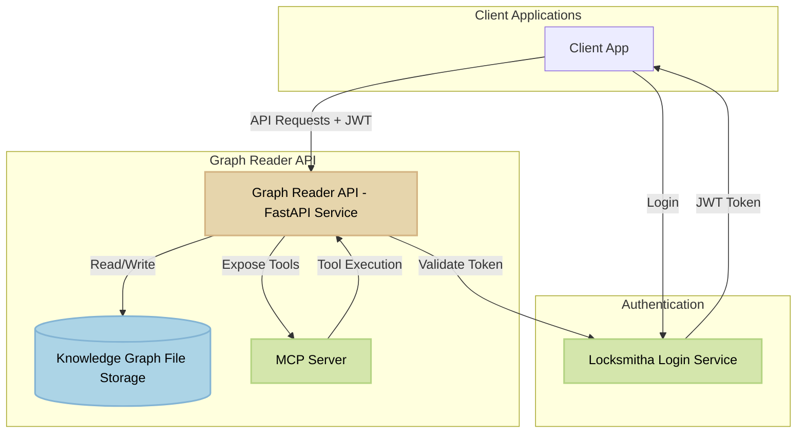

# Graph Reader API

<p align="center">
  
</p>

This project wraps the graph_reader_api library with a FastAPI service, adding community retrieval functionality.

This library enables fast graph traversal and lookup from file-based storage with sharded and indexed structure.
Now includes community exploration.

[](https://github.com/beanone/graph_reader_api/blob/main/LICENSE)
[](https://github.com/beanone/graph_reader_api/actions?query=workflow%3Atests)
[](https://codecov.io/gh/beanone/graph_reader_api)
[](https://github.com/astral-sh/ruff)
[](https://github.com/beanone/graph_reader_api/actions/workflows/docker-publish.yml)

## Table of Contents

- [Architecture](#architecture)
- [Features](#features)
- [Quick Start (Docker Compose)](#quick-start-docker-compose)
- [Endpoints](#endpoints)
- [Docker Configuration](#docker-configuration)
  - [Health Checks](#health-checks)
  - [Resource Limits](#resource-limits)
  - [Security](#security)
  - [Volume Mounting](#volume-mounting)
- [Testing with Postman](#testing-with-postman)
- [Testing MCP Integration](#testing-mcp-integration)

## Architecture



## Features

- Retrieve entity by ID
- Retrieve neighbors of an entity
- Search entities by properties
- Retrieve community an entity belongs to
- List all members of a community
- MCP (Model Context Protocol) support for AI integration
- Health check endpoint for container monitoring
- Resource limits for stable performance

## Quick Start (Docker Compose)

First, ensure you have graph data in the `resources/kg` directory. The Docker setup expects this directory structure:

```
resources/kg/
├── adjacency/
│   └── adjacency.jsonl
├── entities/
│   └── shard_0.jsonl
├── logs/
│   ├── entity_updates.jsonl
│   └── relation_updates.jsonl
├── relations/
│   └── shard_0.jsonl
└── index.db
```

You can generate test data using the fixture generator:

```python
# Generate test data in the resources/kg directory
from tests.fixture_generator import create_test_graph_fixture
create_test_graph_fixture("resources/kg")
```

Then start the service:

```bash
docker-compose up --build
```

The service includes:
- Health check endpoint at `/health`
- Resource limits (1 CPU, 1GB memory)
- Automatic restart on failure
- Volume mounting for knowledge graph data

Access the API at: http://localhost:8000

## Endpoints

- `GET /health` - Health check endpoint for container monitoring
- `GET /entity/{entity_id}`
- `GET /entity/{entity_id}/neighbors`
- `GET /entity/{entity_id}/community`
- `GET /entity/users/me`[^users-me-note]
- `GET /community/{community_id}/members`
- `GET /search?key=name&value=Alice`

[^users-me-note]: Returns the authenticated user's identity and claims as extracted from the JWT. This endpoint is intended to provide user context for graph-related operations. It does not provide user profile management, but only exposes the current user's identity as it relates to the graph domain.

## Docker Configuration

The service is configured with the following Docker features:

### Health Checks
- Endpoint: `/health`
- Interval: 30 seconds
- Timeout: 10 seconds
- Retries: 3
- Start period: 40 seconds

### Resource Limits
- CPU: 1 core
- Memory: 1GB

### Security
- Non-root user for application
- No Python bytecode generation
- Clean dependency installation

### Volume Mounting
- Knowledge graph data mounted at `/app/resources/kg`

## Testing with Postman

A Postman collection is provided to help you test the API endpoints. To use it:

1. Install [Postman](https://www.postman.com/downloads/)

2. Import the collection:
   - Open Postman
   - Click "Import" button
   - Select the collection file: `tests/postman/graph_reader_api.postman_collection.json`

3. The collection includes requests for all available endpoints:
   - Entity operations
   - Community operations
   - Search operations
   - Health check

4. Make sure the API is running locally before testing:
   ```bash
   docker-compose up --build
   ```

5. Use the collection to test endpoints:
   - All requests are pre-configured to use `http://localhost:8000` as the base URL
   - Example data is included in the requests
   - Variables and test scripts are included to validate responses

## Testing MCP Integration

To verify that the MCP server is working correctly, you can use the MCP Inspector tool:

1. Start the API server:
   ```bash
   docker-compose up --build
   ```

2. Install and run the MCP Inspector:
   ```bash
   npx @modelcontextprotocol/inspector node build/index.js
   ```

3. In the MCP Inspector:
   - Pick the Transport Type "SSE"
   - Connect to the MCP server at `http://localhost:8000/mcp`
   - Login using the login server and get the JWT token
   - Open Authentication section:
     - Set Header Name to "Authorization"
     - Set Header Value to "your_jwt_token" (exclude the word "Bearer" as the tool adds it automatically)
   - Navigate to the `Tools` section
   - Click `List Tools` to see all available endpoints
   - Test an endpoint by:
     - Selecting a tool from the list
     - Filling in any required parameters
     - Clicking `Run Tool` to execute

4. Check the server logs for any debugging information if needed

This will help confirm that your MCP server is properly configured and all endpoints are accessible as MCP tools.
